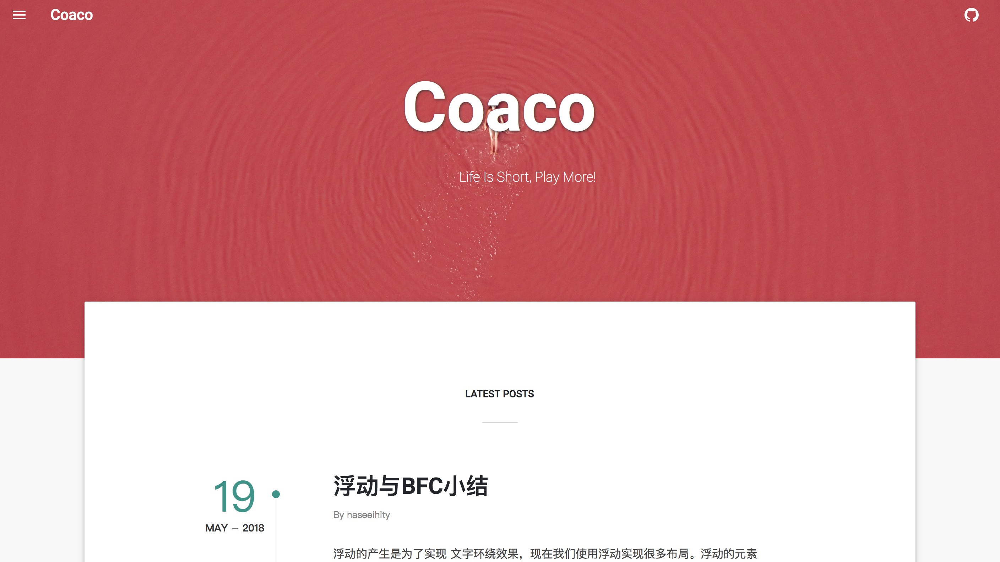
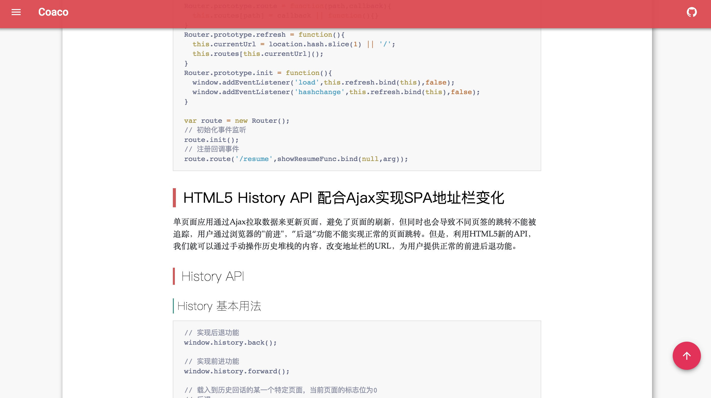

# A Material Designed Blog

Create with `heroku/node-js-getting-started` and `Create React App`.Deployed on [Heroku](https://heroku.com).

## Screenshot



material design and UI inspired by [typography](http://typography-themexpose.blogspot.com/)



use `[Prism](http://prismjs.com/)` for code highlight

## Techs

front-end

* React
* React-Router
* CSS Modules
* Redux(plan to use when write Management interface)

UI-framework

* material-ui

back-end

* express
* postgresql
* sequelize(in plan)

build

* webpack

## Third-party libraries

* [react-jss](https://github.com/cssinjs/react-jss) sovle css modules problem with material-uii
* [react-paginate](https://github.com/AdeleD/react-paginate) a simple paginate component, add router support for it

## locally run

```
// install latest nodejs and npm or yarn

// install express and other node modules for service part
yarn install or npm i
cd frontend && yarn install or npm i

// run the service
npm start

// run the client
cd frontend && npm start
```

## Todo

* [x] add a sideMenu
* [x] add gobackTop button
* [x] rewrite the paginate component to support react-router
* [ ] add a gallery page
* [ ] a simple management page(may use redux)
* [ ] save and get the articles by postgresql and sequelize
* [ ] mobile adaptation
